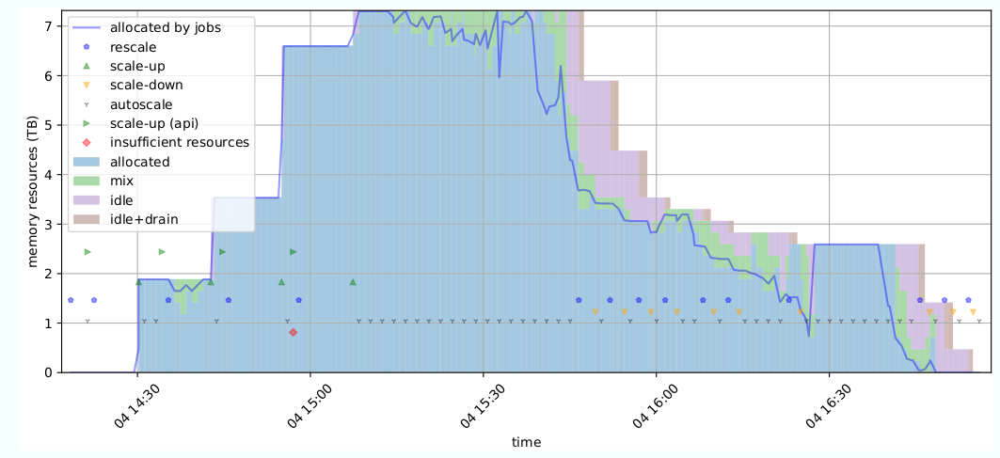
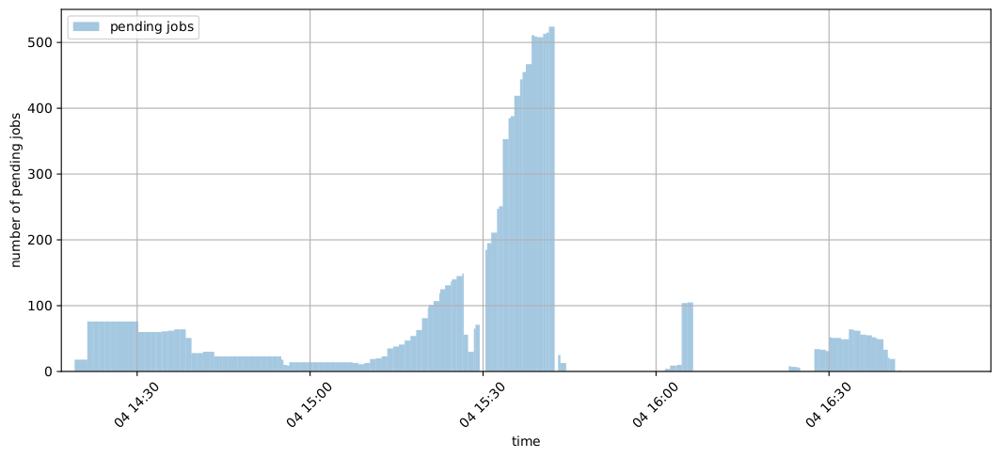

# autoscaling cluster

## usage
Autoscaling can be started as a service, which regularly checks the currently required workers in the background, or manually with appropriate parameters. The program files are located inside the folder `{HOME}\autoscaling`.


## install
The program is developed and tested to work with SimpleVM. The predefined scheduler is slurm. Other schedulers are possible by integrating appropriate interfaces.

The setup inside the SimpleVM cluster is done with a separate [ansible role](https://github.com/patricS4/autoscaling-config-ansible) during the cluster generation.

## start
* download `autoscaling.py` and `autoscaling_config.yaml` to `${HOME}/autoscaling/`
* define a new cluster password with `autoscaling -p`

### cluster password
A password is regenerated with each scaling operation and this new password is returned via the cloud api as a response. For the first start a manual entry of the initial password is necessary. A new password can be set with the `-password`  parameter. The password is automatically saved in a file named `cluster_pw.json` inside the `autoscaling` folder.

## usage

```
        Option      : Long option       :    Argument     : Meaning
        ----------------------------------------------------------------------------------
        _           :                   :                 : rescale with worker check
        -v          : -version          :                 : print the current version number
        -h          : -help             :                 : print this help information
        -fv         : -flavors          :                 : print available flavors
        -m          : -mode             :                 : activate mode from configuration
        -p          : -password         :                 : set cluster password
        -rsc        : -rescale          :                 : run scaling with ansible playbook 
        -s          : -service          :                 : run as service
        -i          : -ignore           :                 : ignore workers
        -sdc        : -scaledownchoice  :                 : scale down (worker id) - interactive mode
        -sdb        : -scaledownbatch   :                 : scale down (batch id)  - interactive mode
        -suc        : -scaleupchoice    :                 : scale up - interactive mode
        -sdi        : -scaledownidle    :                 : scale down all workers (idle + worker check)
        -csd        : -clustershutdown  :                 : delete all workers from cluster (api)
        -u          : -update           :                 : update autoscaling (exclude configuration)
        -d          : -drain            :                 : set manual nodes to drain
                    : -reset            :                 : reset autoscaling and configuration
                    : -start            :                 : systemd: (re-)start service
                    : -stop             :                 : systemd: stop service
                    : -status           :                 : systemd: service status
                    : -visual           :                 : visualize log data (generate pdf)
                    : -visual           :"y-m-t-h:y-m-t-h": visualize log data by time range
                    : -clean            :                 : clean log data
```

### program service
The Autoscaling program can be started as a service. It checks the current situation every minute to see whether jobs are pending and additional workers are needed, or whether workers are not required.
The decision whether to take action depends on the current configuration and pending jobs.

### available files
* config parameters
  * location: `${HOME}/autoscaling/autoscaling_config.yaml`
  * the active mode is defined as `active_mode`
* csv log data for visualization
  * location: `${HOME}/autoscaling/autoscaling.csv`
* program log messages
  * `${HOME}/autoscaling/autoscaling.log`
* pid file: prevents multiple instances from starting at the same time
  * `${HOME}/autoscaling/autoscaling.pid`
* password file: contains the current password of the cluster
  * `${HOME}/autoscaling/cluster_pw.json`

### visual data
The data from the csv file can be visualized. Memory is decisive for the costs, which is why the memory consumption is visualized with the respective worker state according to the scheduler. In this example, time analysis is active with the mode `multi`. We can see that around `15:30`, a lot of jobs are in pending, but no worker is started because these are mostly short jobs. Shortly thereafter, the workload drops and the workers are deleted after a defined time. The scale-down takes place in several stages.



#### legend
* *autoscaling*: Start of the autoscaling program.
* *rescale*: Start of the re-scaling and re-configuring of the cluster.
* *allocated by jobs*: Used memory from allocated Jobs.
* *scale-up*: Mark when a scale-up process is finished.
* *scale-down*: Mark when a scale-down process is completed.
* *error*: There is an error by current workers or API Response.
* *scale-down drain*: Additional scale-down marker, an early scale-down by drain workers is finished.
* *un-drain worker*: If Workers are marked as drain and not deleted, they can be reactivated if a new job requires these resources.
* *scale-up (api)*: A scale-up request was sent to the API interface. Several requests can be sent one after the other, depending on the `flavor_depth` setting.
* *insufficient resources*: The generated workers are reduced because of missing resources according to flavor data.
* *pending jobs*: Number of pending jobs in the scheduler queue.

### mode selection
There are already predefined modes in the configuration file.
To activate a specific mode, set the `active_mode` variable to a desired mode name inside the configuration file. An interactive selection inside the program is possible with `autoscaling -mode`.
The program uses modes defined inside the configuration file. To activate a specific mode, set the `active_mode` variable to a desired mode name. There are predefined modes in the configuration file.

###  autoscaling configuration
* config parameters are located at `${HOME}/autoscaling/autoscaling_config.yaml`
  * modes can be edited and defined
* start another mode with `autoscaling -m <mode>`


#### predefined modes
The predefined modes reflect use cases of different user needs. For this reason, some modes are specified as examples in a configuration file. The user can select a mode according to the required behavior over a program parameter without editing the configuration. The file can be adjusted by the user and define or optimize modes. The user knows what fits best for the respective application. The basic mode is used as a reference, when defining new modes, only a setting that deviates from the basic configuration needs to be redefined. For all other modes, a setting from the basic configuration is used unless additionally defined.
The modes are tested with experimental workflows. Due to the wide range of possible settings, user based modifications may create better results for an individual pipeline.

* basic
  * The mode uses basic parameters and will scale according to pending jobs, the required resources and possible parallel jobs on a flavor. This mode has no limitations and does not take into account the job duration. Without additional calculations, it is a mode that starts a comparatively high number of workers.
* approach
  * The approach mode is without job time analysis. Since too many workers can easily be started in this mode, there is a start limit of ten workers per flavor and program cycle. The worker starts are limited by a worker weight variable. The flavor calculation is set to multiple flavors.
* sequence
  * The workers are calculated for the next jobs of the same flavor. The time based job analysis for past jobs is activated.
* adaptive
  * The adaptive mode contains a balanced intention to start new workers. In addition, the search for similar jobs in the database is activated. The workers are limited to ten per flavor and iteration. The drain nodes option is active for high memory workers with a staged worker replacement. Workers are generated for multiple flavors per iteration.
* multi
  * This mode is suitable for most cases. Workers with multiple flavors are generated, but as long as the workers can also process smaller jobs, they will not be deleted. This mode is the better and faster choice if the jobs are frequented while they are being processed, i.e. smaller jobs are dependent on the larger ones and these are therefore added to the scheduler queue at intervals. The larger non-high memory workers are automatically calculated after exceeding the worker value limit of ten new workers. It should offer a balance of speed due to the multiple flavor starts and the balanced use of smaller and larger workers. Since no viable workers are replaced, there is no loss of time and resources due to drain. 
* reactive
  * The reactive mode has no worker forecast and a light time threshold.
* flavor
  * This mode uses a worker start limit per iteration. The time-forecast is restricted to the flavor level for jobs that cannot be grouped by pattern.
* maximum
  * The maximum required worker mode ensures that only the largest required flavor is used for pending jobs. The mode is typically a bad choice for the average user, since no smaller flavors are generated for pending jobs, especially compared to the credit difference with high memory flavors.
* minimum
  * The minimum workers are calculated for pending jobs with single flavor mode and history data. All workers which consume too many resources are replaced with drain larger workers for resource-saving. To reduce the chance of too many workers, a light worker weight and a worker start limit per iteration is set.

#### program settings
* `portal_link`: `https://cloud.denbi.de`
  * Link to the appropriate SimpleVM portal.
* `scheduler`: `slurm`
  * Selected scheduler module.
* `active_mode`: `basic`
  * This mode is active when the service is started.
* `automatic_update`: `True`
  * The program will try to update and restart the program if the current version is outdated.
* `database_reset`: `False`
  * Database rebuilt when a configuration file change is detected.
* `time_range_max`: `1000`
  * Time data is normalized to this range.
  * Set the maximum wide for the time classification range (in seconds). Used in relation to the mode based `job_time_threshold` for new workers.
* `pattern_id`: `'comment'`
  * Another field id than job name can be used for job identification.
* `history_recall`: `7`
  * Initialize the history data retroactive with the specified days.
* `ignore_workers`: `[]`
  * Workers can be completely ignored by autoscaling, these are selectable with `autoscaling -i`.
* `resource_sorting`: `True` 
  * The autoscaling should sort the job queue itself by resources.
  * If false, use job priority from scheduler.

#### mode settings

###### multiple flavor selection
The pending jobs are identified and divided into minimal required flavors. Each flavor represents a level, the jobs with the highest required resources and flavor are on level 0. The level value indicates the amount of different flavors that can be started in one program cycle. If no new worker is generated for the next pending job level, it may be possible to launch workers with smaller flavors.
* `flavor_depth`: `0`
  * workers are generated for each pending job set with the minimal flavor
  * number of possible different flavors per cycle
  * `x` (x=positive value): single flavor in one iteration, search for new workers by the next x flavors
  * `0`: Start only workers for the next jobs with the same flavor in the queue.
  * `-1`: start multiple flavors in one iteration
  * `-2`: no flavor data separation, select the highest flavor
  * `-3`: single flavor in one cycle, but search all flavor levels

###### upper worker limit
Dynamic worker limit per cycle, depends on pending jobs and the selected setting. Maximum number of new workers by `pending job count` * `force`.
* `scale_force`: `0.6`
  * Initial value that determines the strength of the scaling. The value goes from `0` to `1`, the higher, the more instances are started.
* `worker_weight`: `0.02`
  * deactivate with `0`
  * reduce `scale_force` by active workers
    * workers must be able to process pending jobs
  * Describes the weight of a worker. The number of required workers will be lowered the more active workers exist.


###### limitations
* `limit_memory`: `0`
  * The combined consumption of memory by the workers can be limited, the specification is in terabytes.
* `limit_worker_starts`: `0`
  * Defines the maximum number of workers that can be started per cycle.
* `limit_workers`: `0`
  * Limit the amount of running workers.
* `limit_flavor_usage`: 
  * example: `'de.NBI highmem xlarge': 16`


###### timing
* `scale_delay`: `60`
  * Waiting time in seconds to avoid overlaps with the reassignment of workers with jobs before scale-down.
* `worker_cool_down`: `60`
  * Workers receive a minimum idle lifetime (in seconds) for cool down, deactivate with `0`
  * Remaining active workers can reduce the frequency that workers have to be restarted because they are deleted too
    early due to delayed job rescheduling.
  * Delay in seconds, corresponds to the idle time since the last started job until a worker can be deleted.
* `service_frequency`: `60`
  * Autoscaling execution is delayed a specified number of seconds between program iterations.


###### job history
* `smoothing_coefficient`: `0.05`
  * The collected elapsed job times from history are collected by
    * exponential smoothing
      * Offers a faster adjustment based on new jobs, which are fetched from the database, the coefficient is freely selectable.
    * average time with `0`
* `forecast_by_flavor_history`: `True`
  * If jobs are not in history, use the average job time from flavor data.
* `forecast_by_job_history`: `True`
  * If active, search for elapsed job times in history.
  * Jobs are grouped by flavor resources and job identification pattern (default: job name).
* `forecast_active_worker`: `1`
  * Forecast job processing from active workers.
  * Use the expected remaining job time from current running jobs. Search for resources on active workers that will
    become available soon.
* `forecast_occupied_worker`: `True`
  * When active workers are occupied with current running jobs, permit a new
    worker even with reduced predicted time effort to speed up processing. This
    option is only usable in combination with `forecast_active_worker`.
* `job_match_value`: `0.95`
  * Search for job patterns in history with the provided accuracy.
* `job_time_threshold`: `0.50`
  * The smaller the value (0-1), the more new workers are calculated per time.
  * It serves as a time border for new workers. The smaller the variable, the more workers are started for shorter jobs. The range of values should be in the range of `0 < job_time_threshold < 1`.
* `flavor_time_threshold`: `'de.NBI highmem xlarge': 1`
  * Set flavor name based time threshold, a separate setting each flavor name is possible.

* job pattern modification
  * Remove artifacts from job names. Jobs are grouped by a pattern for identification, for example the job name.
    * `job_name_remove_numbers`: `True`
      * remove numbers from job names
    * `job_name_remove_num_brackets`: `True`
      * numbers in brackets not included in the comparison
    * `job_name_remove_pattern`: `'wPipeline_'`
      * remove a *pattern* from job name
    * `job_name_remove_text_within_parentheses`: `True`
      * remove any string within parentheses


###### flavor selection
* `flavor_restriction`: `0`
  * The number of `0.8` would truncate 20% of the smaller flavors from the bottom. An integer value of three would ignore the last three smaller flavors. If the value is 0, this function is disabled.
* `flavor_default`: `'de.NBI highmem large'`
  * If activated (not empty) and the flavor is eligible, use this flavor.
* `flavor_ephemeral`: `True`
  * only use ephemeral flavors by automatic scaling
* `flavor_gpu`: `1`
  * GPU ('Graphics Processing Unit') flavor selection
  * `0` no change
  * `1` remove GPU flavors
  * `-1` only GPU flavors


###### select large flavors 
Usually the smallest available flavor is used, alternatively, multiple jobs can be collapsed into one or more major flavors.
* `large_flavors`: `False`
  * calculate a larger flavor to process multiple jobs on one worker
  * incompatible with drain mode
  * `large_flavors_except_hmf`: `True`
    * exclude high memory worker
  * `auto_activate_large_flavors`: `0`
    * Automatic activation of large flavors, if scale-up value is above this new worker threshold.

###### replace large workers
If smaller workers are sufficient for the jobs in the queue, the resource-guzzling workers are set to drain and deleted as soon as possible. In order to delete the workers, the program has to wait until they get the status `Idle` and are therefore "free". New smaller workers are started for the jobs in the queue.

This option will set larger nodes than required by the jobs into drain state. Jobs can finish, but no new jobs will be started on the node. As soon as the node reaches the status `idle+drain`, it can be deleted. Large instances consume more resources and are more expensive, especially with high memory flavors.


* `drain_large_nodes`: `False`
  * Set large nodes to drain, if nodes with lower flavors are suitable for pending jobs.
  * incompatible with large flavors
  * `drain_only_hmf`: `False`
    * The drain setting is restricted to high memory workers.
  * `drain_delay`: `0`
    * Select a drain type, how to react by workers without a matching pending job.
    * `60` : positive value
      * Wait a defined number of seconds until last usage with a suitable job.
    * `0` : immediate drain
      * May cause time-consuming worker restarts, if corresponding jobs are added frequently.
    * `-1` : negative value, keep 50% + `|-1|` from this flavor during iteration
      * Workers are set to drain in stages, but keep a fixed number active.

###### scheduler settings
* slurm configuration example
  ```
    scheduler_settings: |
    PriorityType=priority/multifactor
    PriorityFavorSmall=NO
    PriorityWeightJobSize=100000
    AccountingStorageTRES=cpu,mem,gres/gpu
    PriorityWeightTRES=cpu=1000,mem=2000,gres/gpu=3000
  ```
* Select own scheduler settings, influence the job scheduling order for example over job priority.
* Only updated if supported by the ansible playbook.

###### Python dependencies

* python>=3.8
* Slurm interface
  * Pyslurm
    * https://github.com/PySlurm/pyslurm/tree/slurm-20.11.8
  * cython>=0.29.32
* numpy>=1.23.5
* pandas>=1.5.2
* matplotlib>=3.6.2
* pyyaml>=6.0
* requests>=2.28.1