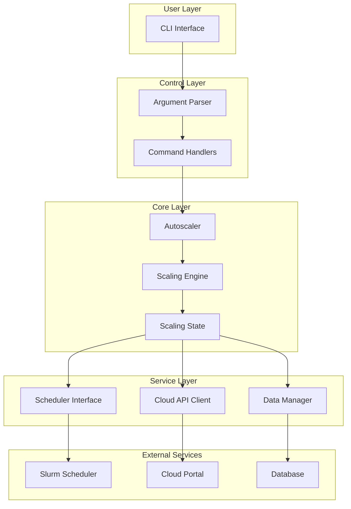
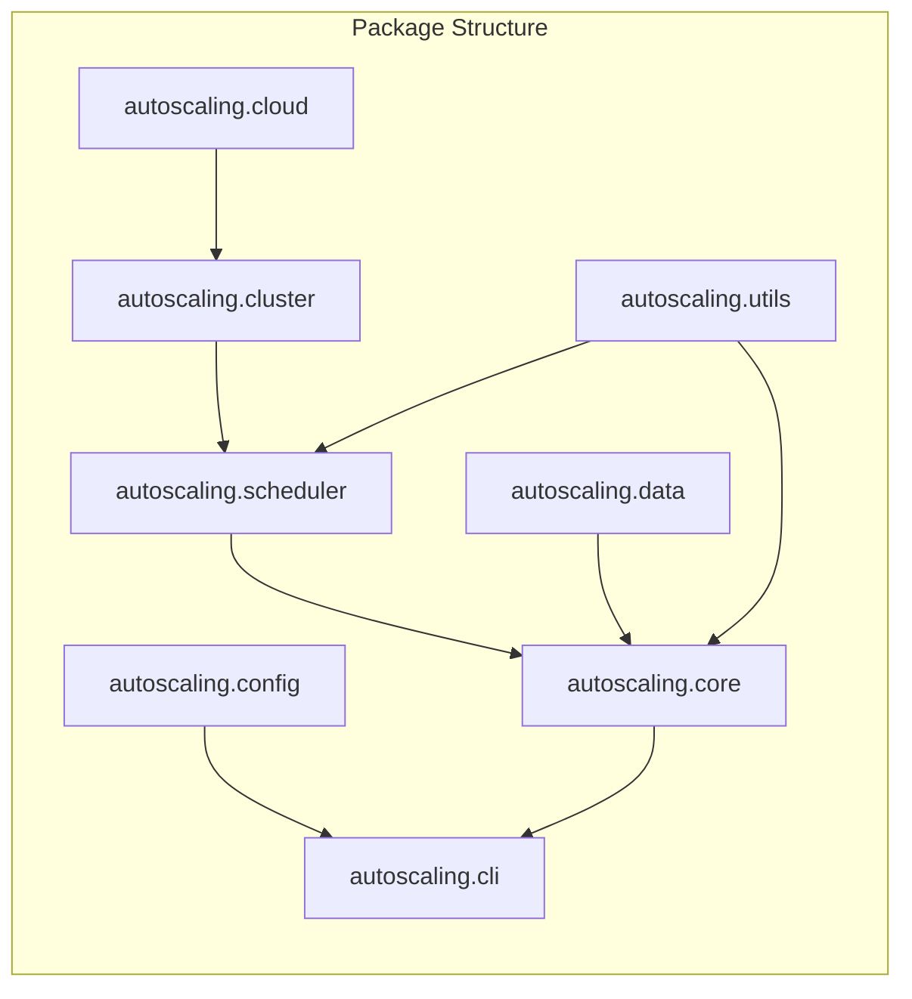
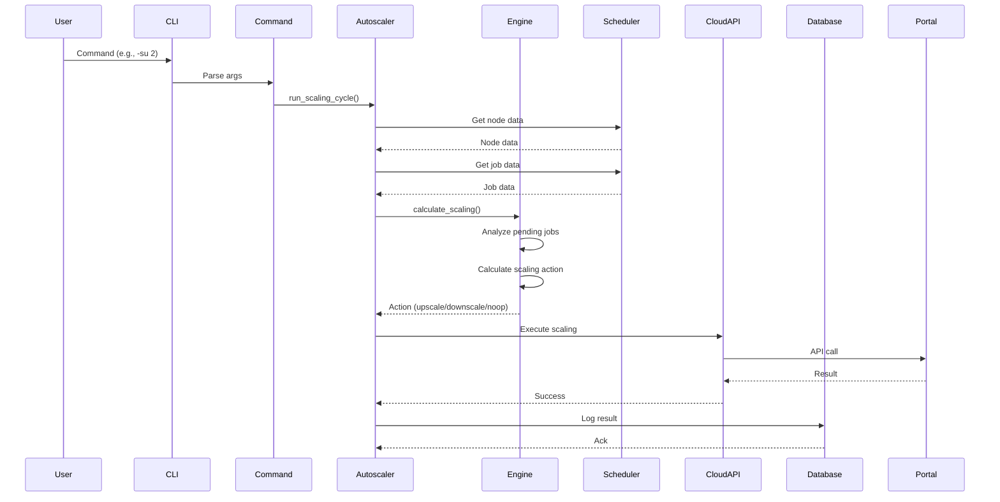
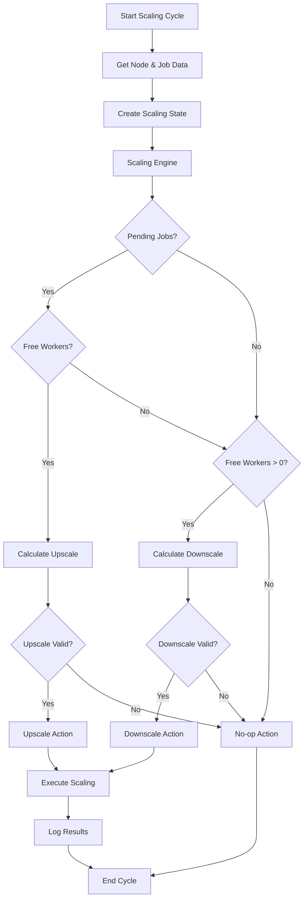
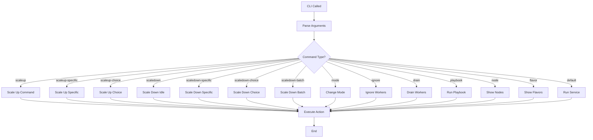

# Architecture Diagrams

## System Overview

```mermaid
graph TB
    subgraph "User Layer"
        CLI[CLI Interface]
    end

    subgraph "Control Layer"
        Parser[Argument Parser]
        Commands[Command Handlers]
    end

    subgraph "Core Layer"
        Autoscaler[Autoscaler]
        Engine[Scaling Engine]
        State[Scaling State]
    end

    subgraph "Service Layer"
        Scheduler[Scheduler Interface]
        CloudAPI[Cloud API Client]
        DataMgr[Data Manager]
    end

    subgraph "External Services"
        Slurm[Slurm Scheduler]
        Portal[Cloud Portal]
        Database[Database]
    end

    CLI --> Parser
    Parser --> Commands
    Commands --> Autoscaler
    Autoscaler --> Engine
    Engine --> State
    State --> Scheduler
    State --> CloudAPI
    State --> DataMgr
    Scheduler --> Slurm
    CloudAPI --> Portal
    DataMgr --> Database
```

## Module Structure

```mermaid
graph LR
    subgraph "Package Structure"
        Config[autoscaling.config]
        Core[autoscaling.core]
        Scheduler[autoscaling.scheduler]
        Cloud[autoscaling.cloud]
        Data[autoscaling.data]
        Utils[autoscaling.utils]
        Cluster[autoscaling.cluster]
        CLI[autoscaling.cli]
    end

    Config --> CLI
    Core --> CLI
    Scheduler --> Core
    Cloud --> Cluster
    Data --> Core
    Utils --> Core
    Utils --> Scheduler
    Cluster --> Scheduler
```

## Data Flow

```mermaid
sequenceDiagram
    participant User
    participant CLI
    participant Command
    participant Autoscaler
    participant Engine
    participant Scheduler
    participant CloudAPI
    participant Database

    User->>CLI: Command (e.g., -su 2)
    CLI->>Command: Parse args
    Command->>Autoscaler: run_scaling_cycle()
    Autoscaler->>Scheduler: Get node data
    Scheduler-->>Autoscaler: Node data
    Autoscaler->>Scheduler: Get job data
    Scheduler-->>Autoscaler: Job data
    Autoscaler->>Engine: calculate_scaling()
    Engine->>Engine: Analyze pending jobs
    Engine->>Engine: Calculate scaling action
    Engine-->>Autoscaler: Action (upscale/downscale/noop)
    Autoscaler->>CloudAPI: Execute scaling
    CloudAPI->>Portal: API call
    Portal-->>CloudAPI: Result
    CloudAPI-->>Autoscaler: Success
    Autoscaler->>Database: Log result
    Database-->>Autoscaler: Ack
```

## Scaling Decision Logic

```mermaid
flowchart TD
    Start[Start Scaling Cycle] --> GetData[Get Node & Job Data]
    GetData --> State[Create Scaling State]
    State --> Engine[Scaling Engine]
    Engine --> CheckJobs{Pending Jobs?}
    CheckJobs -->|Yes| CheckFree{Free Workers?}
    CheckJobs -->|No| CheckDownscale{Free Workers > 0?}
    CheckFree -->|Yes| CalculateUp[Calculate Upscale]
    CheckFree -->|No| CheckDownscale
    CheckDownscale -->|Yes| CalculateDown[Calculate Downscale]
    CheckDownscale -->|No| Noop[No-op Action]
    CalculateUp --> CheckLimits{Upscale Valid?}
    CalculateDown --> CheckDownLimits{Downscale Valid?}
    CheckLimits -->|Yes| UpscaleAction[Upscale Action]
    CheckLimits -->|No| Noop
    CheckDownLimits -->|Yes| DownscaleAction[Downscale Action]
    CheckDownLimits -->|No| Noop
    UpscaleAction --> Execute[Execute Scaling]
    DownscaleAction --> Execute
    Noop --> End[End Cycle]
    Execute --> Log[Log Results]
    Log --> End
```

## CLI Command Flow

```mermaid
graph TD
    Start[CLI Called] --> Parse[Parse Arguments]
    Parse --> Route{Command Type?}
    
    Route -->|scaleup| ScaleUpCmd[Scale Up Command]
    Route -->|scaleup-specific| ScaleUpSpec[Scale Up Specific]
    Route -->|scaleup-choice| ScaleUpChoice[Scale Up Choice]
    Route -->|scaledown| ScaleDownCmd[Scale Down Idle]
    Route -->|scaledown-specific| ScaleDownSpec[Scale Down Specific]
    Route -->|scaledown-choice| ScaleDownChoice[Scale Down Choice]
    Route -->|scaledown-batch| ScaleDownBatch[Scale Down Batch]
    Route -->|mode| ModeCmd[Change Mode]
    Route -->|ignore| IgnoreCmd[Ignore Workers]
    Route -->|drain| DrainCmd[Drain Workers]
    Route -->|playbook| PlaybookCmd[Run Playbook]
    Route -->|node| ShowNodesCmd[Show Nodes]
    Route -->|flavor| ShowFlavorsCmd[Show Flavors]
    Route -->|default| RunService[Run Service]
    
    ScaleUpCmd --> Execute[Execute Action]
    ScaleUpSpec --> Execute
    ScaleUpChoice --> Execute
    ScaleDownCmd --> Execute
    ScaleDownSpec --> Execute
    ScaleDownChoice --> Execute
    ScaleDownBatch --> Execute
    ModeCmd --> Execute
    IgnoreCmd --> Execute
    DrainCmd --> Execute
    PlaybookCmd --> Execute
    ShowNodesCmd --> Execute
    ShowFlavorsCmd --> Execute
    RunService --> Execute
    
    Execute --> End[End]
```
